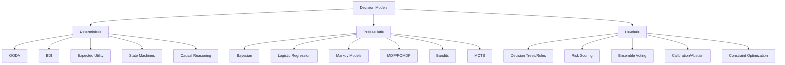

# Decision Models Taxonomy

This document groups decision‑model patterns into three families:

- **Deterministic**: Same inputs yield the same outputs with no randomness.
- **Probabilistic**: Uses uncertainty or distributions to drive decisions.
- **Heuristic**: Uses rules of thumb; not guaranteed optimal.

## When To Use Which

- **Deterministic**: You need predictable, explainable results.
- **Probabilistic**: You need to reason under uncertainty or noisy signals.
- **Heuristic**: You need fast, simple decisions with acceptable tradeoffs.

## Pattern Tag Matrix

| Pattern | Deterministic | Probabilistic | Heuristic | Notes |
|---|---|---|---|---|
| OODA Loop | ✅ |  |  | Deterministic loop, can plug in probabilistic parts |
| BDI Agent | ✅ |  |  | Belief/goal selection is deterministic here |
| Bayesian Reasoning |  | ✅ |  | Explicit probabilistic update |
| Logistic Regression |  | ✅ |  | Probabilistic classifier |
| Markov Models |  | ✅ |  | Stochastic transitions |
| Risk Scoring | ✅ |  | ✅ | Often heuristic thresholds |
| MDP/POMDP |  | ✅ |  | Decision under uncertainty |
| Bandits (Explore‑Exploit) |  | ✅ | ✅ | Stochastic + heuristic policies |
| Expected Utility | ✅ |  |  | Deterministic choice over probabilistic outcomes |
| Decision Trees / Rules | ✅ |  | ✅ | Rule‑based heuristics |
| MCTS |  | ✅ | ✅ | Stochastic rollouts + heuristic search |
| Ensemble Voting | ✅ |  | ✅ | Deterministic aggregation of heuristics |
| Calibration / Abstain | ✅ |  | ✅ | Thresholded policy |
| Constraint Optimization |  |  | ✅ | Greedy heuristic implementation here |
| Causal Reasoning | ✅ |  |  | Deterministic structural equations in this repo |
| State Machines | ✅ |  |  | Explicit transition tables |

## Taxonomy Map

