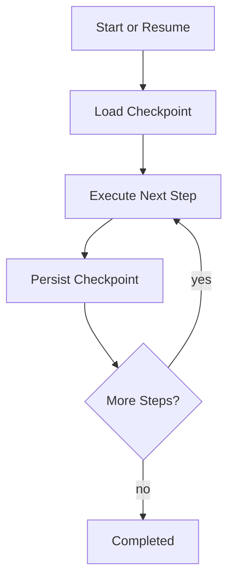

```mermaid
flowchart TD
    A[Start or Resume] --> B[Load Checkpoint]
    B --> C[Execute Next Step]
    C --> D[Persist Checkpoint]
    D --> E{More Steps?}
    E -->|yes| C
    E -->|no| F[Completed]
```
