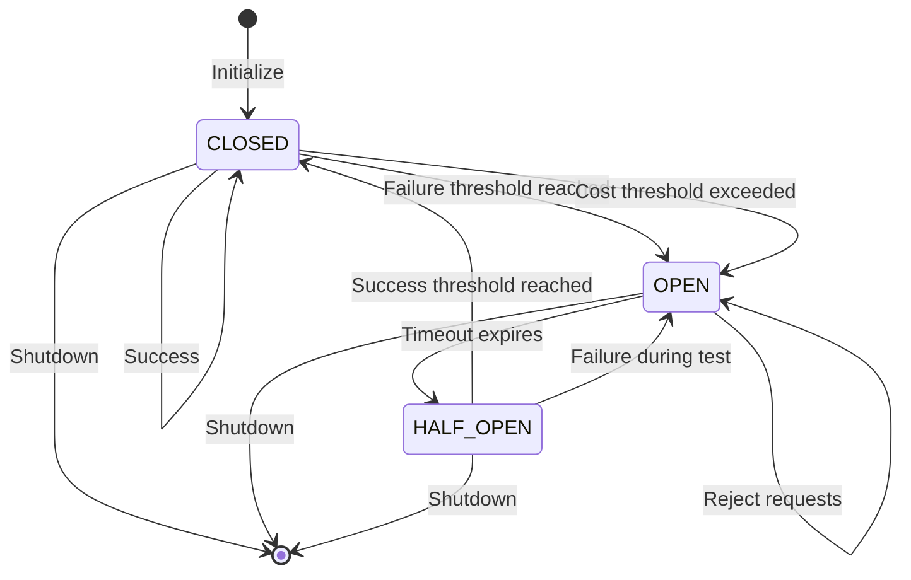
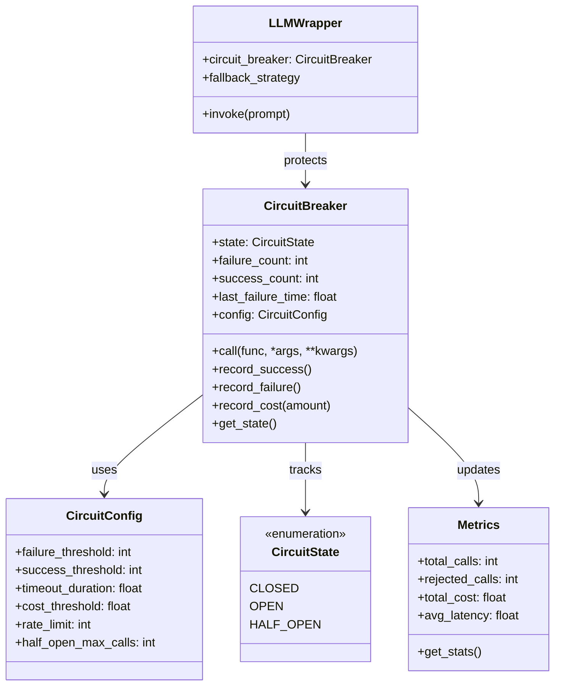

# Circuit Breaker Architecture

## State Machine



## Component Diagram



## Request Flow

```
┌─────────────────────────────────────────────────────────────┐
│                    Request Flow                             │
├─────────────────────────────────────────────────────────────┤
│                                                             │
│  Request                                                    │
│     │                                                       │
│     ▼                                                       │
│  ┌─────────────────────────────────────────────────────┐   │
│  │ Check Circuit State                                  │   │
│  │                                                      │   │
│  │ State = CLOSED? ──Yes──▶ Execute Request            │   │
│  │    │                                                 │   │
│  │    No                                                │   │
│  │    │                                                 │   │
│  │ State = HALF_OPEN? ──Yes──▶ Allow Limited           │   │
│  │    │                       Requests                  │   │
│  │    No                                                 │   │
│  │    │                                                 │   │
│  │ State = OPEN? ──Yes──▶ Reject Immediately           │   │
│  │                      Return Fallback / Error         │   │
│  └────────────────────┬────────────────────────────────┘   │
│                       │                                      │
│                       ▼                                      │
│  ┌─────────────────────────────────────────────────────┐   │
│  │ Execute LLM Call                                     │   │
│  │                                                      │   │
│  │ Success? ──Yes──▶ Record Success                    │   │
│  │    │                        │                       │   │
│  │    │                        ▼                       │   │
│  │    │                 Check Success Threshold        │   │
│  │    │                 Reached? ──Yes──▶ Close Circuit│   │
│  │    │                                              │   │
│  │    No                                             │   │
│  │    │                                              │   │
│  │    ▼                                              │   │
│  │ Record Failure                                    │   │
│  │    │                                              │   │
│  │    ▼                                              │   │
│  │ Check Failure Threshold                           │   │
│  │ Reached? ──Yes──▶ Open Circuit                    │   │
│  │    │                        │                       │   │
│  │    No                        ▼                       │   │
│  │                    Start Timeout Timer              │   │
│  │                    Reject Future Requests           │   │
│  └─────────────────────────────────────────────────────┘   │
│                                                             │
└─────────────────────────────────────────────────────────────┘
```

## Cost Protection Flow

```
┌─────────────────────────────────────────────────────────────┐
│                 Cost Protection Mechanism                   │
├─────────────────────────────────────────────────────────────┤
│                                                             │
│  Request                                                    │
│     │                                                       │
│     ▼                                                       │
│  ┌─────────────────────────────────────────────────────┐   │
│  │ Check Cost Budget                                    │   │
│  │                                                      │   │
│  │ Current Cost: $45.50                                │   │
│  │ Budget Limit: $50.00                                │   │
│  │                                                      │   │
│  │ Estimate Request Cost: $2.00                        │   │
│  │                                                      │   │
│  │ $45.50 + $2.00 = $47.50 < $50.00 ──▶ ALLOW         │   │
│  │                                                      │   │
│  │ Would exceed? ──Yes──▶ REJECT                       │   │
│  │    │                           │                     │   │
│  │    │                           ▼                     │   │
│  │    │                   Return Quota Exceeded Error   │   │
│  │    │                                                   │   │
│  │    ▼                                                   │   │
│  │ Execute Request                                        │   │
│  │    │                                                   │   │
│  │    ▼                                                   │   │
│  │ Record Actual Cost: $1.85                              │   │
│  │ Update Running Total: $47.35                           │   │
│  │                                                        │   │
│  └─────────────────────────────────────────────────────┘   │
│                                                             │
│  Time Window: Rolling 1-hour window                         │
│  Reset: Costs expire after window                           │
│                                                             │
└─────────────────────────────────────────────────────────────┘
```
