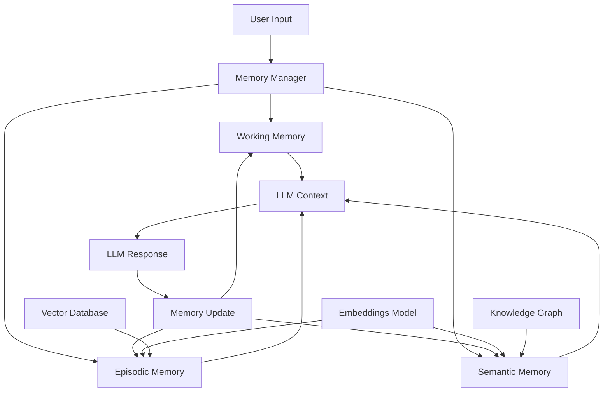
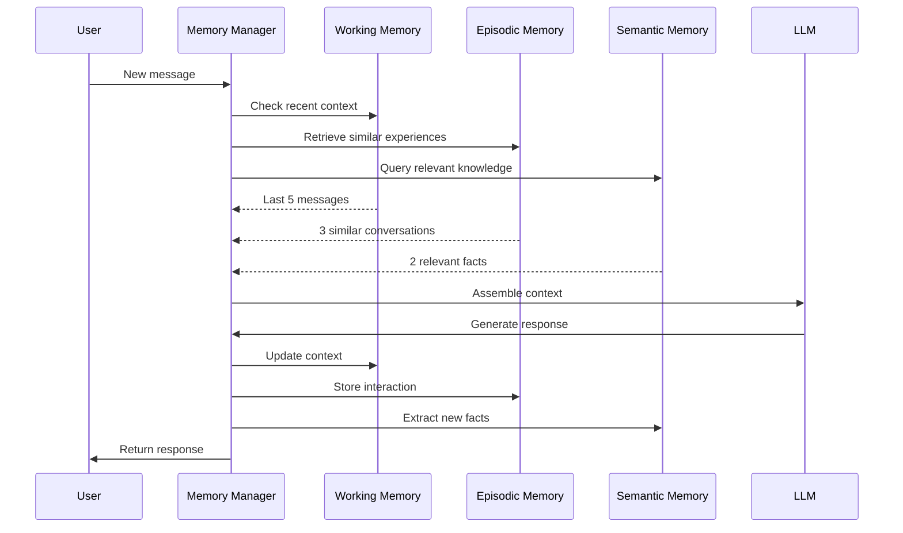
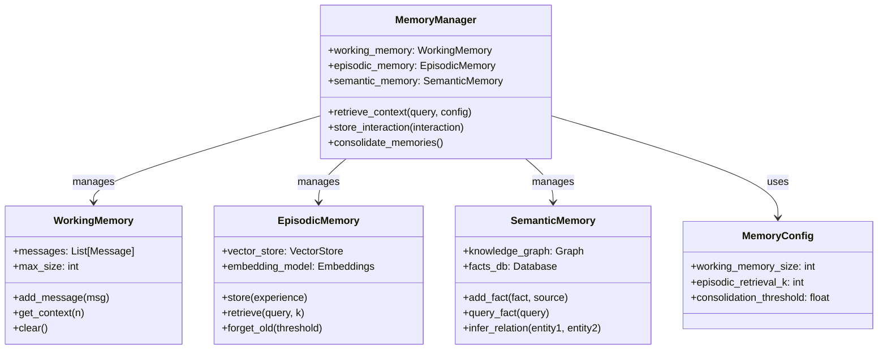

# Memory Hierarchy Architecture

## System Overview



## Data Flow



## Component Architecture



## Memory Retrieval Flow

```
┌──────────────────────────────────────────────────────────────┐
│                   Memory Retrieval                           │
├──────────────────────────────────────────────────────────────┤
│                                                              │
│  Input: "What's the status of my project?"                  │
│                                                              │
│  ┌───────────────────────────────────────────────────────┐  │
│  │ 1. WORKING MEMORY RETRIEVAL                            │  │
│  │                                                        │  │
│  │ Recent messages:                                       │  │
│  │ - User: "Check project status"                        │  │
│  │ - Assistant: "Which project?"                         │  │
│  │ - User: "The website redesign"                        │  │
│  │                                                        │  │
│  │ Retrieved: "Website redesign project"                 │  │
│  └───────────────────────────────────────────────────────┘  │
│                            │                                 │
│                            ▼                                 │
│  ┌───────────────────────────────────────────────────────┐  │
│  │ 2. EPISODIC MEMORY RETRIEVAL                           │  │
│  │                                                        │  │
│  │ Query: "website redesign project"                     │  │
│  │ Embedding: [0.23, -0.45, 0.89, ...]                   │  │
│  │                                                        │  │
│  │ Similar experiences:                                   │  │
│  │ - "Last week discussed website timeline" (0.92)       │  │
│  │ - "User prefers weekly updates" (0.78)                │  │
│  │ - "Previous project: mobile app" (0.65)               │  │
│  │                                                        │  │
│  │ Retrieved: Timeline discussion, update preference     │  │
│  └───────────────────────────────────────────────────────┘  │
│                            │                                 │
│                            ▼                                 │
│  ┌───────────────────────────────────────────────────────┐  │
│  │ 3. SEMANTIC MEMORY RETRIEVAL                           │  │
│  │                                                        │  │
│  │ Query: "website redesign status tracking"             │  │
│  │                                                        │  │
│  │ Knowledge facts:                                       │  │
│  │ - Website redesign: Status = In Progress              │  │
│  │ - Website redesign: Deadline = 2024-03-15             │  │
│  │ - Project status tracking uses Jira                   │  │
│  │                                                        │  │
│  │ Retrieved: Current status, deadline, tools used       │  │
│  └───────────────────────────────────────────────────────┘  │
│                            │                                 │
│                            ▼                                 │
│  ┌───────────────────────────────────────────────────────┐  │
│  │ 4. CONTEXT ASSEMBLY                                    │  │
│  │                                                        │  │
│  │ [Working Memory]                                       │  │
│  │ The user is asking about the website redesign project │  │
│  │ they mentioned previously.                            │  │
│  │                                                        │  │
│  │ [Episodic Memory]                                     │  │
│  │ Previously, we discussed the timeline for this        │  │
│  │ project. The user prefers weekly status updates.      │  │
│  │                                                        │  │
│  │ [Semantic Memory]                                     │  │
│  │ Project: Website Redesign                             │  │
│  │ Status: In Progress                                   │  │
│  │ Deadline: March 15, 2024                              │  │
│  │ Tracking: Jira board                                  │  │
│  └───────────────────────────────────────────────────────┘  │
│                                                              │
└──────────────────────────────────────────────────────────────┘
```

## Memory Storage Flow

```
New Interaction
       │
       ▼
┌─────────────────────────────────────┐
│ 1. Store in Working Memory          │
│    - Add to message history         │
│    - Trim if exceeds limit          │
└──────────────┬──────────────────────┘
               │
               ▼
┌─────────────────────────────────────┐
│ 2. Store in Episodic Memory         │
│    - Create embedding               │
│    - Store with timestamp           │
│    - Tag with session/user          │
└──────────────┬──────────────────────┘
               │
               ▼
┌─────────────────────────────────────┐
│ 3. Extract Semantic Knowledge       │
│    - Identify facts learned         │
│    - Update knowledge graph         │
│    - Link to existing facts         │
└──────────────┬──────────────────────┘
               │
               ▼
┌─────────────────────────────────────┐
│ 4. Consolidation (Periodic)         │
│    - Summarize old episodes         │
│    - Prune redundant memories       │
│    - Reinforce important facts      │
└─────────────────────────────────────┘
```
