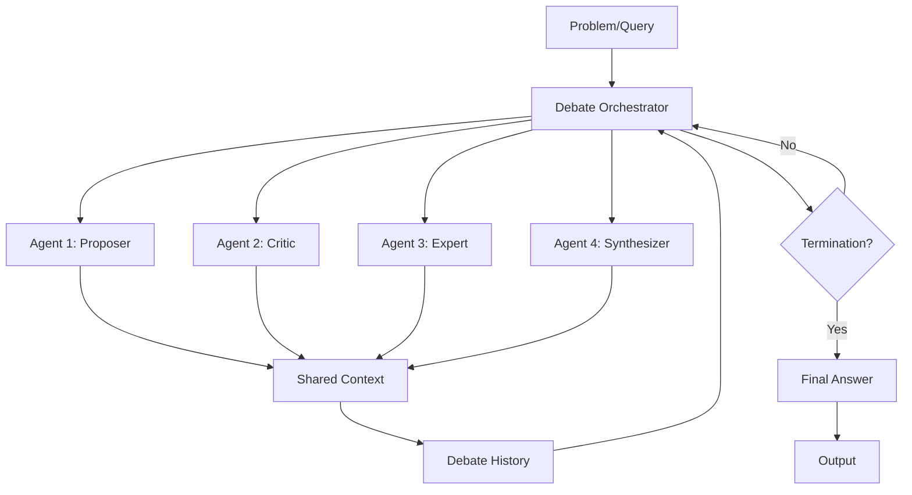
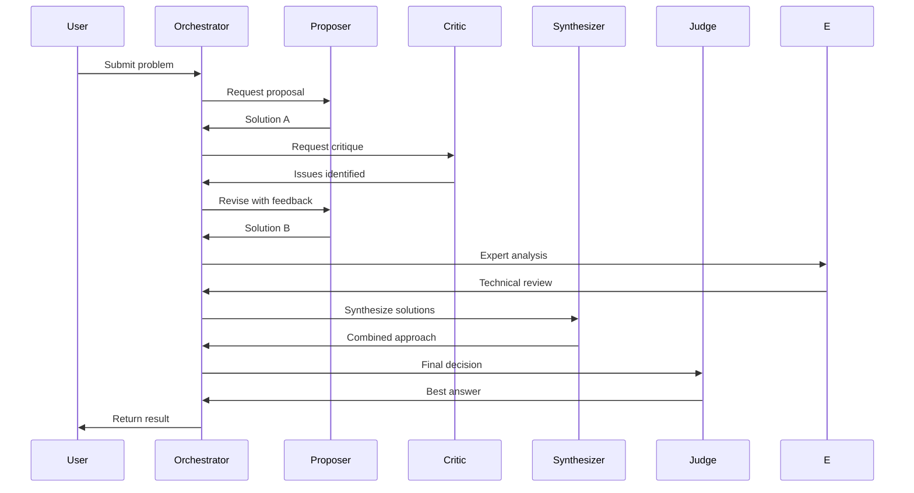
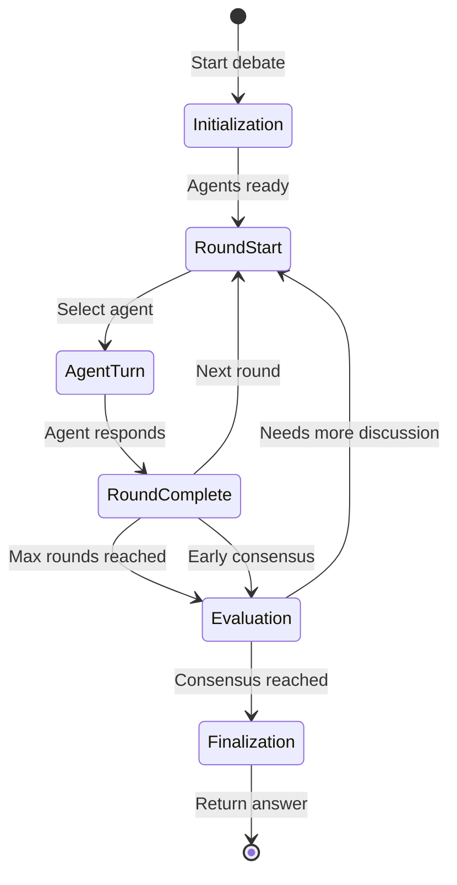

# Multi-Agent Debate Architecture

## System Overview



## Debate Flow



## State Machine



## Agent Interactions

```
┌─────────────────────────────────────────────────────────────────┐
│                    Multi-Agent Debate                           │
├─────────────────────────────────────────────────────────────────┤
│                                                                 │
│  Round 1                                                        │
│  ┌──────────┐    ┌──────────┐    ┌──────────┐                  │
│  │Proposer  │───▶│ Critic   │───▶│ Expert   │                  │
│  │"Use X"   │    │"X fails   │    │"Agreed,  │                  │
│  │          │    │ when Y"  │    │ try Z"   │                  │
│  └──────────┘    └──────────┘    └────┬─────┘                  │
│                                        │                        │
│                                        ▼                        │
│                               ┌──────────────┐                 │
│                               │ Shared Context│                 │
│                               │ - X suggested │                 │
│                               │ - Y is issue  │                 │
│                               │ - Z proposed  │                 │
│                               └──────┬───────┘                 │
│                                      │                          │
│  Round 2                             ▼                          │
│  ┌──────────┐    ┌──────────┐    ┌──────────┐                  │
│  │Proposer  │◀───│ Critic   │◀───│ Expert   │                  │
│  │"Z + W"   │    │"Better,  │    │"Z is     │                  │
│  │(revised) │    │ but..."  │    │ optimal" │                  │
│  └────┬─────┘    └──────────┘    └──────────┘                  │
│       │                                                         │
│       ▼                                                         │
│  ┌──────────┐                                                  │
│  │Synthesizer│                                                  │
│  │"Combine  │                                                  │
│  │ Z and W" │                                                  │
│  └────┬─────┘                                                  │
│       │                                                         │
│       ▼                                                         │
│  ┌──────────┐                                                  │
│  │  Judge   │                                                  │
│  │"Final:   │                                                  │
│  │ Use Z+W" │                                                  │
│  └──────────┘                                                  │
│                                                                 │
└─────────────────────────────────────────────────────────────────┘
```

## Message Flow

```
User Query
    │
    ▼
┌─────────────────────────────────────┐
│ Initialize Debate                   │
│ - Define agents                     │
│ - Set roles                         │
│ - Create shared context             │
└──────────────┬──────────────────────┘
               │
               ▼
┌─────────────────────────────────────┐
│ Round 1                             │
│ ┌───────────────────────────────┐   │
│ │ Proposer: "I suggest using    │   │
│ │ the Strategy pattern..."      │   │
│ └───────────────────────────────┘   │
│              │                      │
│              ▼                      │
│ ┌───────────────────────────────┐   │
│ │ Critic: "Strategy pattern has │   │
│ │ overhead. Consider factory."  │   │
│ └───────────────────────────────┘   │
│              │                      │
│              ▼                      │
│ ┌───────────────────────────────┐   │
│ │ Expert: "For this use case,   │   │
│ │ strategy is actually fine."   │   │
│ └───────────────────────────────┘   │
└──────────────┬──────────────────────┘
               │
               ▼
┌─────────────────────────────────────┐
│ Check Termination                   │
│ - Rounds completed?                 │
│ - Consensus reached?                │
│ - Max cost exceeded?                │
└──────────────┬──────────────────────┘
               │
    ┌──────────┴──────────┐
    │                     │
    ▼                     ▼
┌──────────┐      ┌──────────────┐
│ Continue │      │  Finalize    │
│ Debate   │      │              │
│          │      │ Synthesize   │
│ Round 2  │      │ all views    │
└──────────┘      │ Judge decides│
                  └──────┬───────┘
                         │
                         ▼
                  ┌──────────────┐
                  │ Final Answer │
                  └──────────────┘
```
