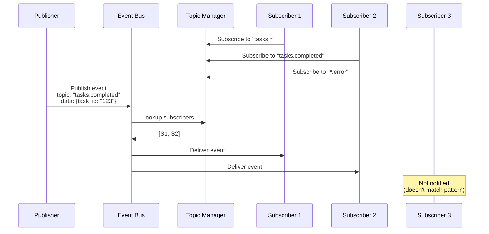
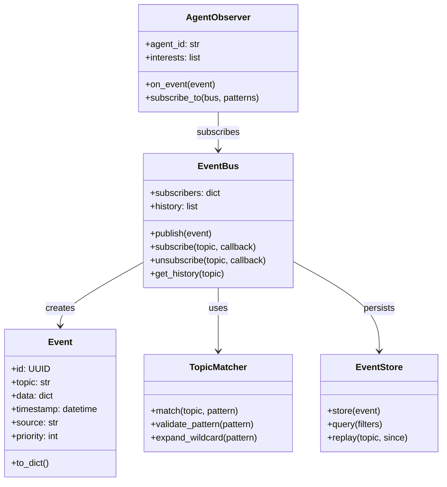

# Observer Pattern Architecture

## System Overview

```mermaid
graph TB
    subgraph "Event Bus"
        EB[Event Bus]<br/>Central Hub
        TM[Topic Manager]
        Q[Event Queue]
    end
    
    subgraph "Publishers"
        P1[Agent A]<br/>Task Agent
        P2[Agent B]<br/>Monitor Agent
        P3[System]<br/>Error Handler
    end
    
    subgraph "Subscribers"
        S1[Agent C]<br/>Logger
        S2[Agent D]<br/>Notifier
        S3[Agent E]<br/>Coordinator
    end
    
    P1 -->|publish| EB
    P2 -->|publish| EB
    P3 -->|publish| EB
    
    EB -->|route| S1
    EB -->|route| S2
    EB -->|route| S3
```

## Event Flow



## Component Diagram



## Topic Patterns

```
┌─────────────────────────────────────────────────────────────┐
│                    Topic Patterns                           │
├─────────────────────────────────────────────────────────────┤
│                                                             │
│  Exact Match:                                               │
│    "task.completed" matches "task.completed"               │
│                                                             │
│  Wildcard (*):                                              │
│    "task.*" matches:                                        │
│      - task.created                                         │
│      - task.completed                                       │
│      - task.failed                                          │
│                                                             │
│  Multi-level Wildcard (**):                                 │
│    "agent.**" matches:                                      │
│      - agent.state.changed                                  │
│      - agent.task.completed                                 │
│      - agent.memory.updated                                 │
│                                                             │
│  Multiple Patterns:                                         │
│    ["task.*", "agent.state.*"]                              │
│                                                             │
│  Negative Patterns:                                         │
│    "task.*.!failed" (all task events except failed)        │
│                                                             │
└─────────────────────────────────────────────────────────────┘
```

## Agent Coordination Flow

```
┌─────────────────────────────────────────────────────────────┐
│               Multi-Agent Coordination                      │
├─────────────────────────────────────────────────────────────┤
│                                                             │
│  Task Creation                                              │
│  ┌──────────┐                                               │
│  │  User    │──"Create report"──▶┌──────────┐              │
│  └──────────┘                   │Coordinator│              │
│                                 └────┬─────┘              │
│                                      │                      │
│                                      ▼                      │
│                               Publish: task.created         │
│                               ┌───────────────┐            │
│                               │ topic: task.created         │
│                               │ data: {                     │
│                               │   task_id: "T1",            │
│                               │   type: "report",           │
│                               │   priority: "high"          │
│                               │ }                           │
│                               └───────┬───────┘            │
│                                       │                     │
│         ┌─────────────────────────────┼─────────────────┐  │
│         │                             │                 │  │
│         ▼                             ▼                 ▼  │
│    ┌─────────┐                  ┌─────────┐        ┌────────┐│
│    │ Research│                  │ Writer  │        │ Review ││
│    │  Agent  │                  │  Agent  │        │  Agent ││
│    └────┬────┘                  └────┬────┘        └───┬────┘│
│         │                            │                 │     │
│    Subscribed                    Subscribed       Subscribed│
│    to: task.*                    to: task.*       to: task.*│
│    priority>medium               priority>medium   priority>medium│
│                                                             │
│  Progress Updates                                           │
│  ┌─────────┐                                                │
│  │ Research│──Publish: task.progress──▶┌─────────┐          │
│  │  Agent  │   data: {                 │Coordinator│         │
│  └─────────┘     task_id: "T1",        └────┬────┘         │
│                  progress: 50%              │               │
│                  }                          ▼               │
│                                    ┌───────────────┐       │
│                                    │ Update UI     │       │
│                                    │ Notify User   │       │
│                                    └───────────────┘       │
│                                                             │
│  Completion                                                 │
│  ┌─────────┐                                                │
│  │ Writer  │──Publish: task.completed──▶┌─────────┐        │
│  │  Agent  │   data: {                  │ Review  │        │
│  └─────────┘     task_id: "T1",          │  Agent  │        │
│                  result: "..."           └────┬────┘        │
│                  }                            │             │
│                                               ▼             │
│                                        Publish:             │
│                                        review.requested     │
│                                                             │
└─────────────────────────────────────────────────────────────┘
```
