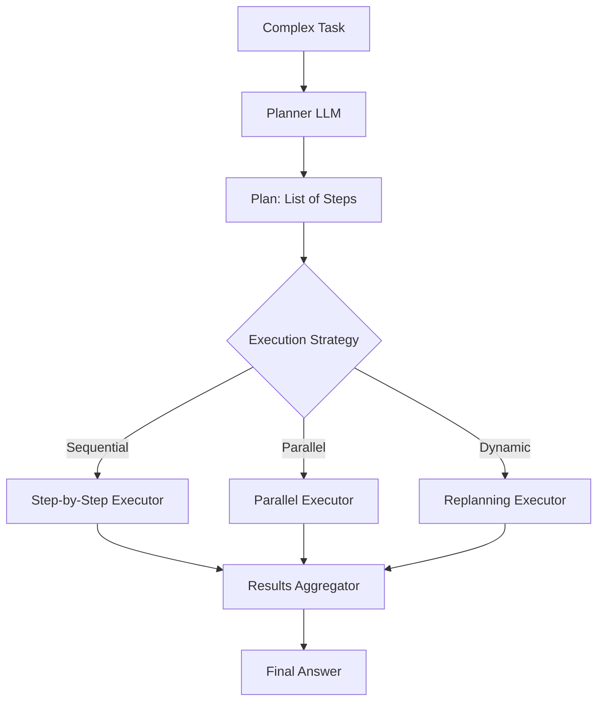
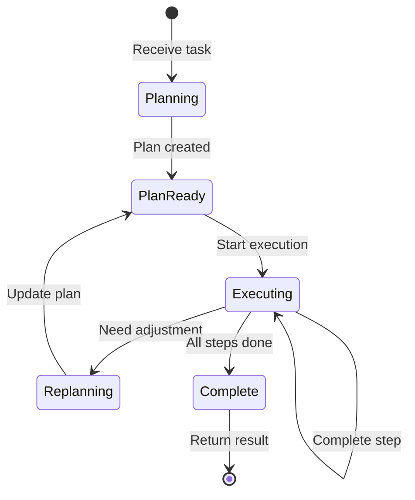
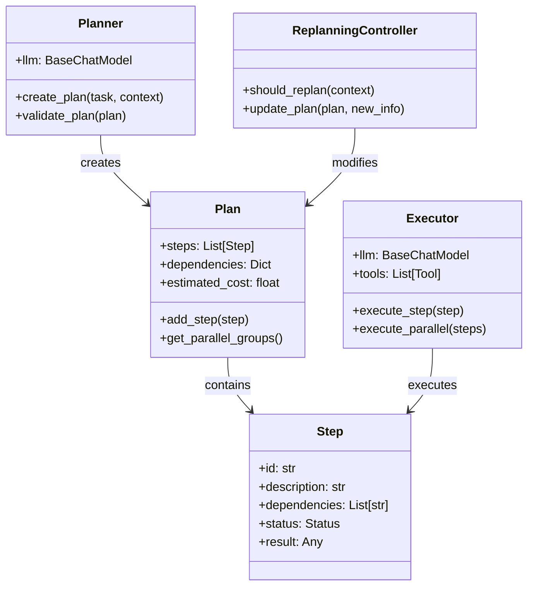

# Plan-and-Execute Architecture

## System Overview



## State Machine



## Component Diagram



## Data Flow

```
┌──────────────────────────────────────────────────────────────┐
│                     Plan & Execute Flow                      │
├──────────────────────────────────────────────────────────────┤
│                                                              │
│  Input: "Summarize the latest AI papers from arXiv"         │
│                                                              │
│  ┌──────────────────────────────────────────────────────┐   │
│  │ PLANNER                                              │   │
│  │ 1. Search for recent AI papers on arXiv             │   │
│  │ 2. Download top 5 papers                             │   │
│  │ 3. Extract key findings from each paper              │   │
│  │ 4. Synthesize into summary                           │   │
│  └────────────────────┬─────────────────────────────────┘   │
│                       │                                      │
│                       ▼                                      │
│  ┌──────────────────────────────────────────────────────┐   │
│  │ PARALLEL GROUPS                                       │   │
│  │ Group 1: [Step 1] → [Step 2]                         │   │
│  │ Group 2: [Step 3 - Paper 1]                          │   │
│  │          [Step 3 - Paper 2]  (parallel)              │   │
│  │          [Step 3 - Paper 3]                          │   │
│  │ Group 3: [Step 4] (depends on Group 2)               │   │
│  └────────────────────┬─────────────────────────────────┘   │
│                       │                                      │
│                       ▼                                      │
│  ┌──────────────────────────────────────────────────────┐   │
│  │ EXECUTOR                                             │   │
│  │ Executing Group 1... ✓                               │   │
│  │ Executing Group 2... ✓ (5 parallel)                  │   │
│  │ Executing Group 3... ✓                               │   │
│  └────────────────────┬─────────────────────────────────┘   │
│                       │                                      │
│                       ▼                                      │
│  ┌──────────────────────────────────────────────────────┐   │
│  │ RESULTS                                              │   │
│  │ Summary: [Combined findings from all papers]         │   │
│  └──────────────────────────────────────────────────────┘   │
│                                                              │
└──────────────────────────────────────────────────────────────┘
```

## Execution Strategies

### Sequential
```
Step 1 → Step 2 → Step 3 → Step 4
  │        │        │        │
  ▼        ▼        ▼        ▼
Result 1  Result 2 Result 3 Result 4
```

### Parallel (by dependency groups)
```
Group 1: [Step 1, Step 2] (no deps)
            │
            ▼
Group 2: [Step 3, Step 4, Step 5] (depend on 1 & 2)
            │
            ▼
Group 3: [Step 6] (depends on 3,4,5)
```

### Dynamic Replanning
```
Execute Step 1 → Discover new info → Replan remaining steps
                                          │
                                          ▼
                               Update Step 3 & 4
                                          │
                                          ▼
                                Continue execution
```
