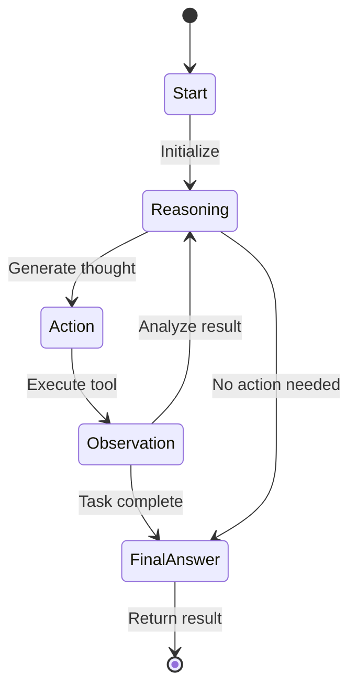
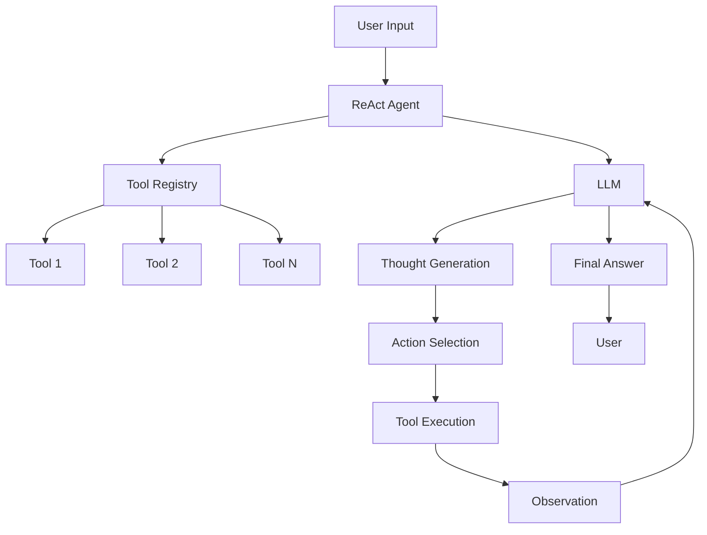

# ReAct Loop Architecture

## State Machine Diagram



## Component Diagram



## Loop Visualization

```
┌─────────────────────────────────────────────────────────────┐
│                      ReAct Loop                             │
├─────────────────────────────────────────────────────────────┤
│                                                             │
│  ┌──────────────┐     ┌──────────────┐                     │
│  │   Thought    │────▶│   Action     │                     │
│  │  "I need to  │     │  search(     │                     │
│  │   search..." │     │    "cats")   │                     │
│  └──────────────┘     └──────┬───────┘                     │
│         ▲                    │                              │
│         │                    ▼                              │
│         │            ┌──────────────┐                      │
│         │            │  Observation │                      │
│         │            │  "Results:    │                      │
│         │            │   10 cats"   │                      │
│         │            └──────┬───────┘                      │
│         │                   │                               │
│         └───────────────────┘                               │
│                                                             │
│                    [Repeat or Finalize]                     │
│                                                             │
└─────────────────────────────────────────────────────────────┘
```

## Message Flow

```
Step 1: Initial Prompt
┌─────────────────────────────────────────────────┐
│ System: You are a helpful assistant...          │
│ User: What is the weather in London?            │
└─────────────────────────────────────────────────┘
                    │
                    ▼
Step 2: Thought Generation
┌─────────────────────────────────────────────────┐
│ Thought: I need to find the current weather     │
│ in London. I should use the weather tool.       │
└─────────────────────────────────────────────────┘
                    │
                    ▼
Step 3: Action
┌─────────────────────────────────────────────────┐
│ Action: weather_tool(location="London")         │
└─────────────────────────────────────────────────┘
                    │
                    ▼
Step 4: Observation
┌─────────────────────────────────────────────────┐
│ Observation: {"temp": 18, "condition": "cloudy"}│
└─────────────────────────────────────────────────┘
                    │
                    ▼
Step 5: Final Answer
┌─────────────────────────────────────────────────┐
│ Final Answer: It's 18°C and cloudy in London.   │
└─────────────────────────────────────────────────┘
```
