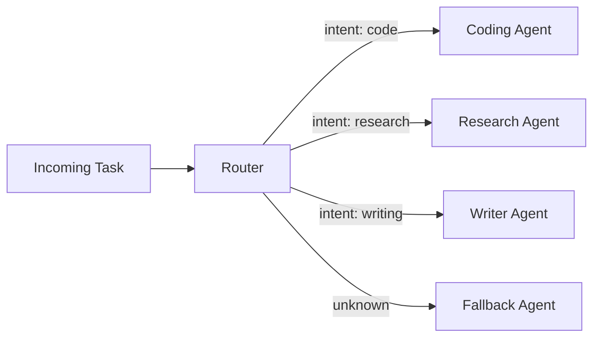

```mermaid
flowchart LR
    A[Incoming Task] --> B[Router]
    B -->|intent: code| C[Coding Agent]
    B -->|intent: research| D[Research Agent]
    B -->|intent: writing| E[Writer Agent]
    B -->|unknown| F[Fallback Agent]
```
