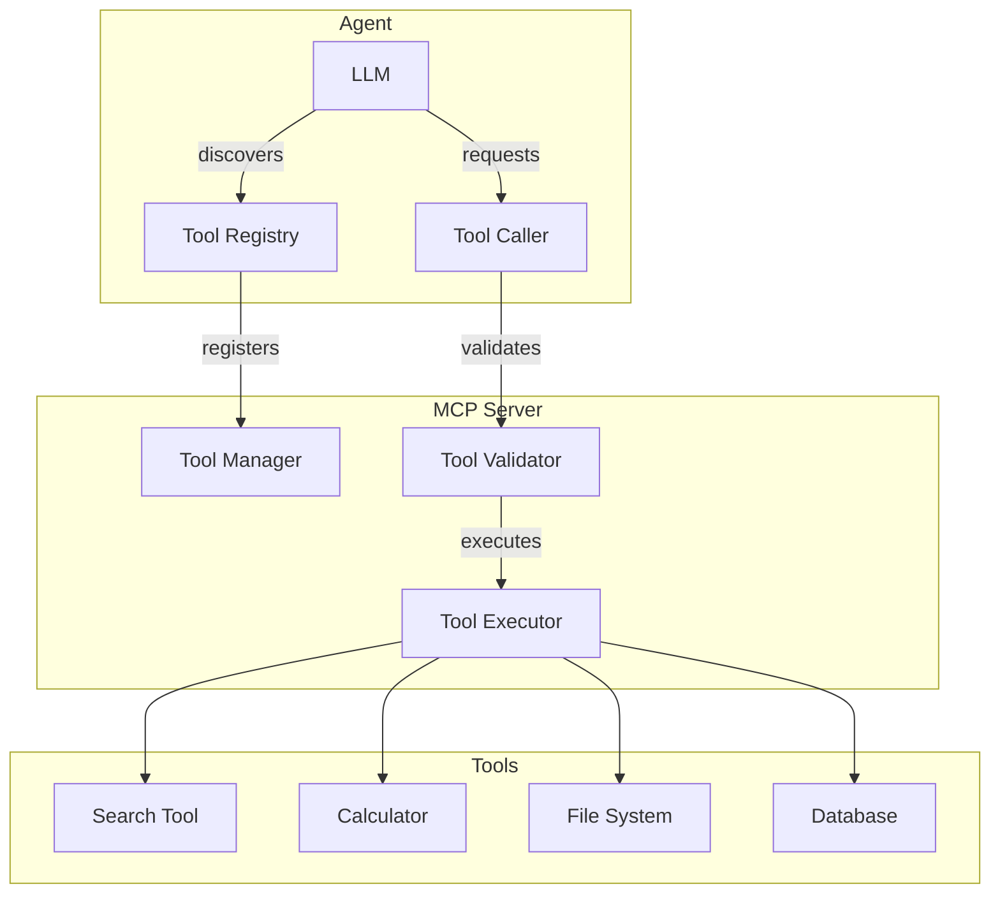
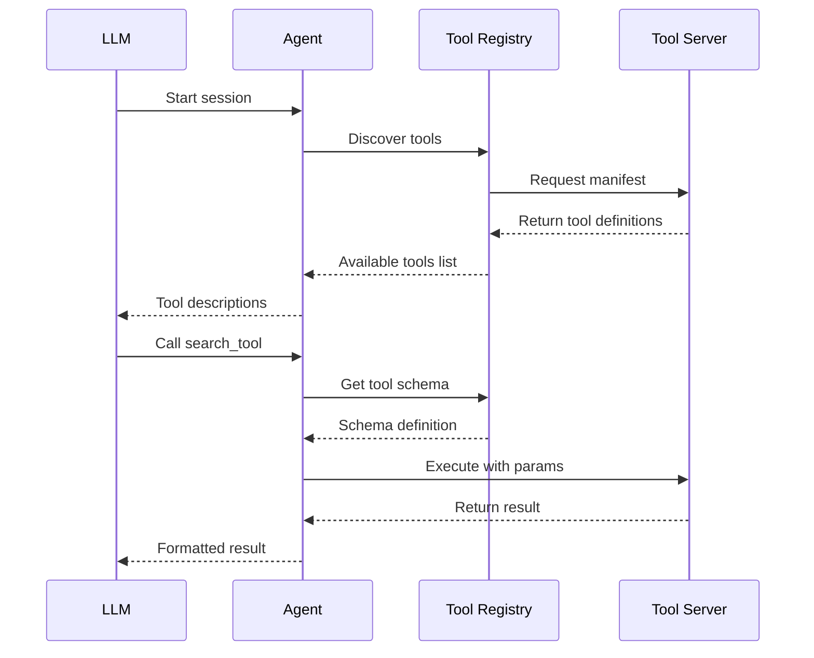
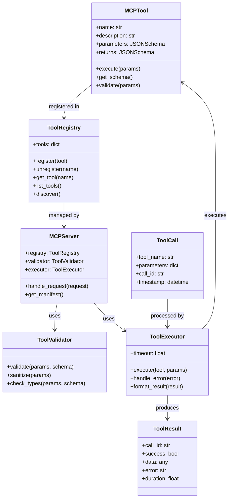

# Tool Use (MCP) Architecture

## System Overview



## Tool Discovery Flow



## Component Diagram



## Tool Execution Flow

```
┌──────────────────────────────────────────────────────────────┐
│                     Tool Execution                           │
├──────────────────────────────────────────────────────────────┤
│                                                              │
│  LLM Request                                                 │
│  "Search for Python tutorials"                               │
│       │                                                      │
│       ▼                                                      │
│  ┌───────────────────────────────────────────────────────┐  │
│  │ 1. Intent Recognition                                  │  │
│  │                                                        │  │
│  │ Match: search_tool                                     │  │
│  │ Confidence: 0.95                                       │  │
│  │ Extracted params: {query: "Python tutorials"}          │  │
│  └────────────────────┬──────────────────────────────────┘  │
│                       │                                      │
│                       ▼                                      │
│  ┌───────────────────────────────────────────────────────┐  │
│  │ 2. Schema Validation                                   │  │
│  │                                                        │  │
│  │ Tool: search_tool                                      │  │
│  │ Required params: ["query"]                             │  │
│  │ Provided: {query: "Python tutorials"}                  │  │
│  │                                                        │  │
│  │ ✓ query: string (valid)                                │  │
│  │                                                        │  │
│  │ Validation: PASSED                                     │  │
│  └────────────────────┬──────────────────────────────────┘  │
│                       │                                      │
│                       ▼                                      │
│  ┌───────────────────────────────────────────────────────┐  │
│  │ 3. Tool Execution                                      │  │
│  │                                                        │  │
│  │ Calling: search_tool                                   │  │
│  │ Params: {query: "Python tutorials"}                    │  │
│  │                                                        │  │
│  │ Executing...                                           │  │
│  │ [External API call]                                    │  │
│  │                                                        │  │
│  │ Duration: 450ms                                        │  │
│  └────────────────────┬──────────────────────────────────┘  │
│                       │                                      │
│                       ▼                                      │
│  ┌───────────────────────────────────────────────────────┐  │
│  │ 4. Result Processing                                   │  │
│  │                                                        │  │
│  │ Raw result:                                            │  │
│  │ {                                                      │  │
│  │   "results": [...],                                    │  │
│  │   "total": 150,                                        │  │
│  │   "page": 1                                            │  │
│  │ }                                                      │  │
│  │                                                        │  │
│  │ Formatted for LLM:                                     │  │
│  │ "Found 150 Python tutorials. Top results: ..."         │  │
│  └────────────────────┬──────────────────────────────────┘  │
│                       │                                      │
│                       ▼                                      │
│  ┌───────────────────────────────────────────────────────┐  │
│  │ 5. Response to LLM                                     │  │
│  │                                                        │  │
│  │ <Tool Result>                                          │  │
│  │ search_tool found 150 Python tutorials.                │  │
│  │ Here are the top 3 results:                            │  │
│  │ 1. Python Official Tutorial                            │  │
│  │ 2. Real Python - Learn Python Programming              │  │
│  │ 3. Python for Beginners - Full Course                  │  │
│  │ </Tool Result>                                         │  │
│  └───────────────────────────────────────────────────────┘  │
│                                                              │
└──────────────────────────────────────────────────────────────┘
```

## Error Handling

```
┌─────────────────────────────────────────────────────────────┐
│                   Error Handling                            │
├─────────────────────────────────────────────────────────────┤
│                                                             │
│  Validation Error                                           │
│  ┌──────────────┐                                           │
│  │ Missing param│──▶ Return: {                              │
│  │ Wrong type   │     error: "Validation failed",          │
│  │ Invalid value│     details: "Parameter 'x' must be      │
│  └──────────────┘              a number, got 'abc'"         │
│                              }                              │
│                                                             │
│  Execution Error                                            │
│  ┌──────────────┐                                           │
│  │ API timeout  │──▶ Return: {                              │
│  │ Network error│     error: "Execution failed",           │
│  │ Tool crash   │     details: "Request timeout after 30s",│
│  └──────────────┘     retryable: true                       │
│                              }                              │
│                                                             │
│  Result Error                                               │
│  ┌──────────────┐                                           │
│  │ Bad format   │──▶ Return: {                              │
│  │ Missing field│     error: "Invalid result",             │
│  │ Type mismatch│     details: "Missing required field      │
│  └──────────────┘              'id' in response"            │
│                              }                              │
│                                                             │
└─────────────────────────────────────────────────────────────┘
```
